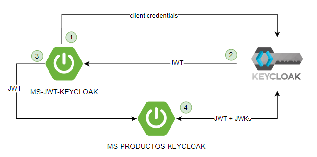

# MS-JWT-KEYCLOAK
Microservicio encargado de obtener un JWT mediante client credentials enviadas a la herramienta Keycloak. El siguiente diagrama representa el caso de uso en que participa ms-jwt

MS-PRODUCTOS-KEYCLOAK: https://github.com/CaterinMorales/MS-PRODUCTOS-KEYCLOAK